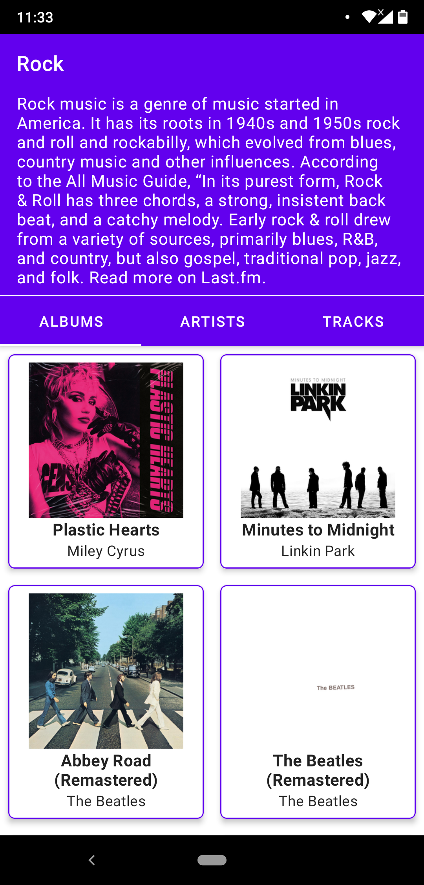
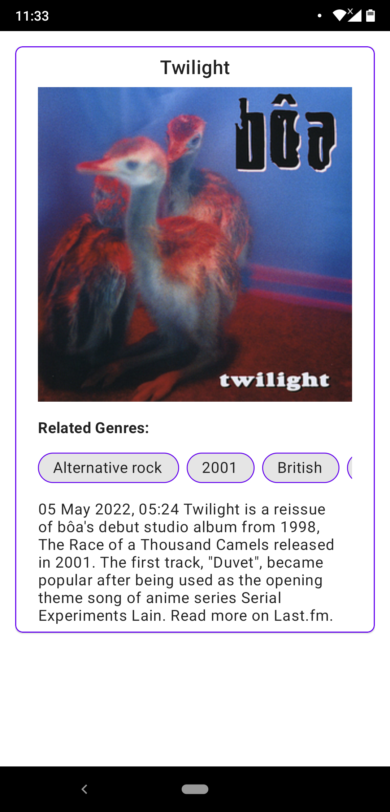
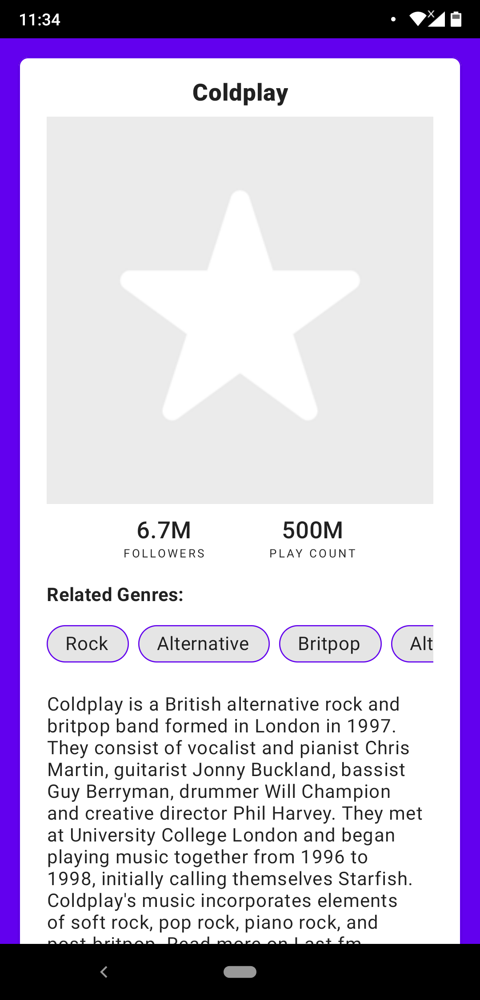
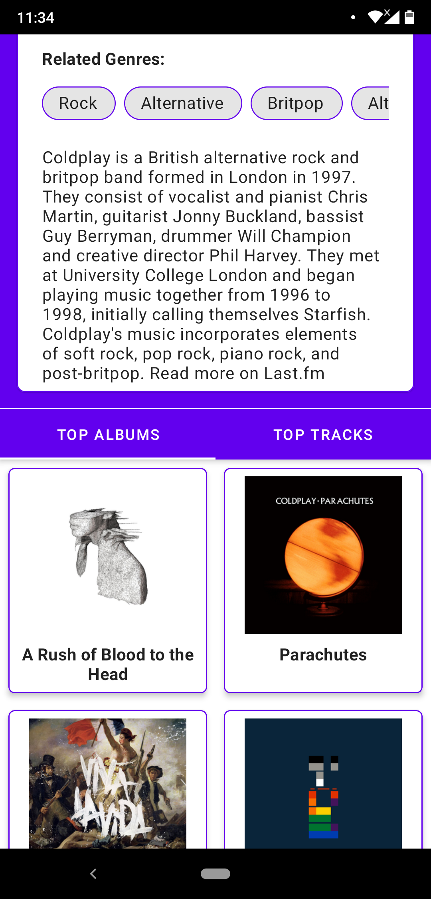

# MusicWiki Android application assessment
This repository contains the application given as an assessment during the GreedyGame Internship Interview

**Music Wiki** is application which fetches the realtime music genres, artists, albums, tracks and provides information on these.

<table>
  <tr>
    <td> </td>
    <td></td>
   </tr> 
   <tr>
      <td></td>
      <td>
  </td>
  </tr>
  <tr>
      <td></td>
  </td>
  </tr>
</table>

## Features
* User enters the app with showing the genres list to choose among.
* Choosing the genre shows its albums, artists and tracks.
* Material design guidelines followed to increase the user experience.

## Project structure (MVVM)
* adapter
* di
* model
* network
* paging
* repository
* utility
* view
* viewmodel

## The project follows the following architecture


## Tech stack used
- Primary language used is Kotlin
- [Retrofit 2](https://square.github.io/retrofit/) - REST client for making network calls.
- [Coroutines](https://developer.android.com/kotlin/coroutines) - For asynchronous operations.
- [Paging3](https://developer.android.com/topic/libraries/architecture/paging/v3-migration) - For displaying the chunk of data from larger datasets over the network calls. Hence consuming less resources.
- [ViewModel](https://developer.android.com/topic/libraries/architecture/viewmodel) - Lifecycle aware library to manage data observing the lifecycle of licecycle owner.
- [Hilt-Dagger](https://dagger.dev/hilt/) - Recommended Dependency Injection Framework for Android.
- [Kotlin Flows](https://developer.android.com/kotlin/flow) - Emits sequence of values or data, and can be consumed or computed asynchronously.

## Licence
```
MIT License

Copyright (c) 2023 Aditya Shidlyali

Permission is hereby granted, free of charge, to any person obtaining a copy
of this software and associated documentation files (the "Software"), to deal
in the Software without restriction, including without limitation the rights
to use, copy, modify, merge, publish, distribute, sublicense, and/or sell
copies of the Software, and to permit persons to whom the Software is
furnished to do so, subject to the following conditions:

The above copyright notice and this permission notice shall be included in all
copies or substantial portions of the Software.

THE SOFTWARE IS PROVIDED "AS IS", WITHOUT WARRANTY OF ANY KIND, EXPRESS OR
IMPLIED, INCLUDING BUT NOT LIMITED TO THE WARRANTIES OF MERCHANTABILITY,
FITNESS FOR A PARTICULAR PURPOSE AND NONINFRINGEMENT. IN NO EVENT SHALL THE
AUTHORS OR COPYRIGHT HOLDERS BE LIABLE FOR ANY CLAIM, DAMAGES OR OTHER
LIABILITY, WHETHER IN AN ACTION OF CONTRACT, TORT OR OTHERWISE, ARISING FROM,
OUT OF OR IN CONNECTION WITH THE SOFTWARE OR THE USE OR OTHER DEALINGS IN THE
SOFTWARE.
```
